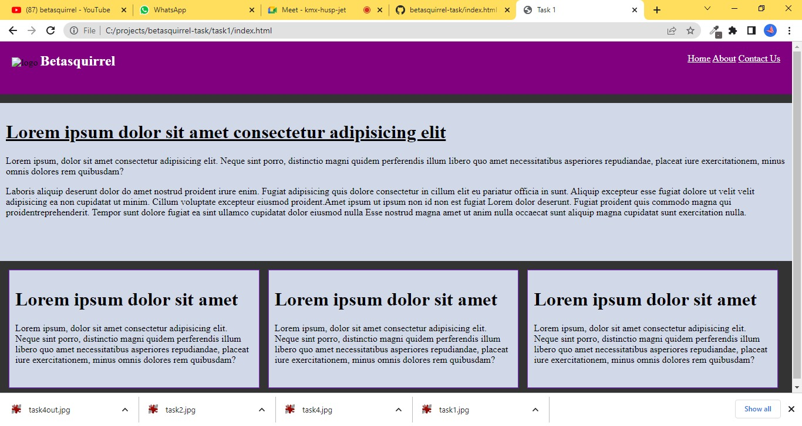
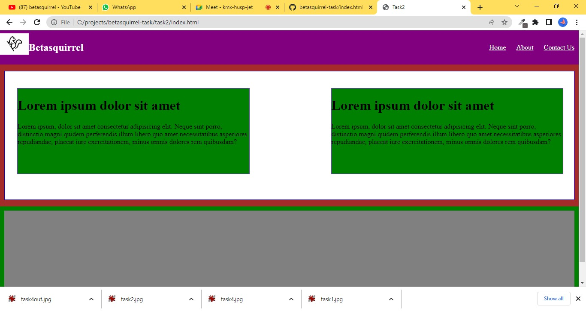
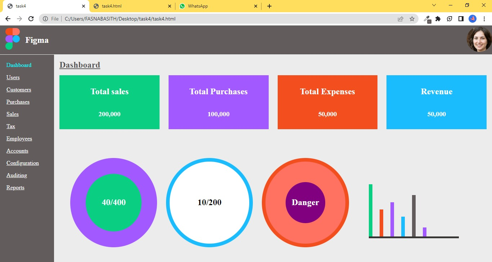

# betasquirrel-task

Assignments from betasquirrel

## Demo

- [Live](https://fasnakallai.github.io/betasquirrel-task/)

## Profile Links

- [Github](http://github.com/Fasnakallai)
- [Linkdin](www.linkedin.com/in/fasna-k-53b089266)
- [Stackoverflow](https://stackoverflow.com/users/21204663/fasna-kallai)

## Tasks

| Requirements                | Output                         |
| --------------------------- | ------------------------------ |
|   |  |
|  |  |
|  |  |

## Task 3

- [HTML Home](https://www.w3schools.com/html/default.asp)
- [HTML Introduction](https://www.w3schools.com/html/html_intro.asp)
- [HTML Editor](https://www.w3schools.com/html/html_editors.asp)
- [HTML Basics](https://www.w3schools.com/html/html_basic.asp)
- [HTML Elements](https://www.w3schools.com/html/html_elements.asp)
- [HTML Attributes](https://www.w3schools.com/html/html_attributes.asp)
- [HTML Headings](https://www.w3schools.com/html/html_headings.asp)
- [HTML Paragraphs](https://www.w3schools.com/html/html_paragraphs.asp)
- [HTML Styles](https://www.w3schools.com/html/html_styles.asp)
- [HTML Formatting](https://www.w3schools.com/html/html_formatting.asp)
- [HTML Quotation](https://www.w3schools.com/html/html_quotation.asp)
- [HTML Comments](https://www.w3schools.com/html/html_comments.asp)
- [HTML Color](https://www.w3schools.com/html/html_color.asp)
- [HTML CSS](https://www.w3schools.com/html/html_css.asp)
- [HTML Links](https://www.w3schools.com/html/html_links.asp)
- [HTML Images](https://www.w3schools.com/html/html_images.asp)

## Linux Commands

- 1 - `cd` -Change current directory Eg: `cd Desktop`, `cd ..`
- 2 - `ls` -List contents of a directory, Eg: `ls -a` lists hidden files as well.
- 3 - `pwd` -Display current working directory path
- 4 - `cat` -Display contents of a file. Eg: `cat README.md`
- 5 - `rm` -The rm command is used to remove file Eg: `rm <file name>`
- 6 - `clear` To clear the screen Eg: `clear`
- 7 - `mkdir` To create new directory Eg: `mkdir projects`
- 8 - `ssh-keygen` Generate ssh key Eg: `ssh-keygen -t ed25519 -c "myemail@gmail.com"`

## Git Commands

- 1 - `Git Config` - Configure git user .Eg: `git config --global user.name "Fasnakallai"` , `git config --global user.email "fasnakallai21@gmail.com"`
- 2 - `Git clone` -clone a remote git repo to your local Eg: `git clone https://github.com/Fasnakallai/betasquirrel-task.git`, `git clone https://github.com/Fasnakallai/betasquirrel-task.git new-folder`
- 3 - `Git Add .` - add your file changes to git Eg: `git add README.md`
- 4 - `Git Commit` -commit changes to git. Eg: `git commit -m "initial commit"`
- 5 - `Git push` - Push your local commits to remote repo Eg: `git push origin main`
- 6 - `Git pull` - this command fetches and mergeschanges on the remote server to your working durectory
- 7 - `git reset` - This command undoes all the commits after the specified commit and preserves the changes locally Eg: `git reset` [commit]
- 8 -`git config --list`-To see the config added
- 9 -`git config --hard`-remove all changes
- 10 -`git status`-To see the current changes as list
- 11 -`git diff`-See the changes on each file
- 12 -`git log`-See commit history
- 13 -`git stash`-Stash your uncommited changes
- 14 -`git init`-Initialize git repo

## Task 5

- [HTML Favicon](https://www.w3schools.com/html/html_favicon.asp)
- [HTML Tables](https://www.w3schools.com/html/html_tables.asp)
- [HTML Table Borders](https://www.w3schools.com/html/html_Tableborders.asp)
- [HTML Table Sizes](https://www.w3schools.com/html/html_tablesizes.asp)
- [HTML Table Headers](https://www.w3schools.com/html/html_tableheaders.asp)
- [HTML Table padding &Spacing](https://www.w3schools.com/html/html_tablepadding&spacing.asp)
- [HTML Table Colspan &Rowspan](https://www.w3schools.com/html/html_tablecolspan&rowspan.asp)
- [HTML Table Styling](https://www.w3schools.com/html/html_tablestyling.asp)

## Task 6

- [CSS Table](https://www.w3schools.com/css/css_table.asp)
- [CSS Table Size](https://www.w3schools.com/css/css_table_size.asp)
- [CSS Table Align](https://www.w3schools.com/css/css_table_align.asp)
- [CSS Table Style](https://www.w3schools.com/css/css_table_style.asp)
- [CSS Table Responsive](https://www.w3schools.com/css/css_table_responsive.asp)
- [CSS Form](https://www.w3schools.com/css/css_form.asp)
